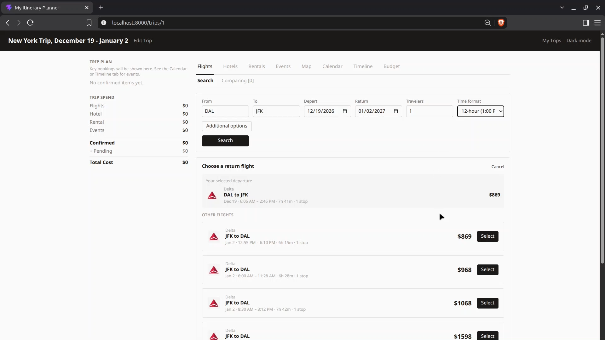
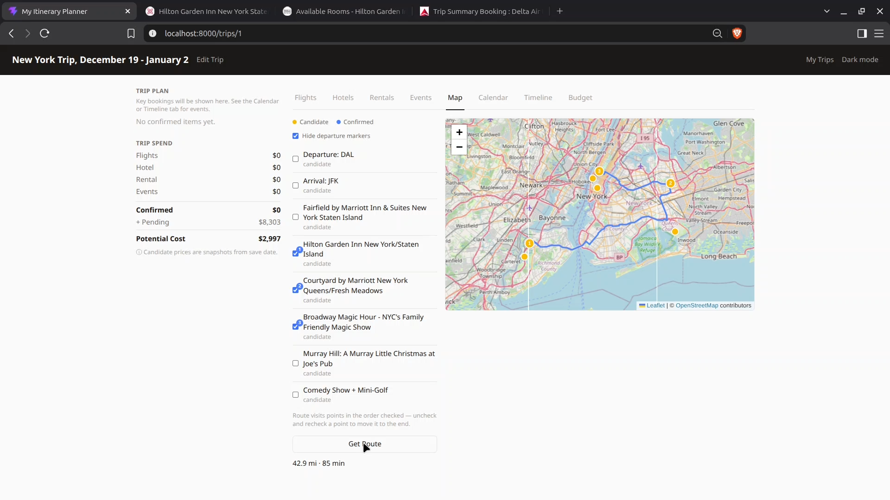

# My Itinerary Planner

[](https://github.com/thomasmendez/my-itinerary-planner/actions/workflows/backend.yml)
[](https://github.com/thomasmendez/my-itinerary-planner/actions/workflows/frontend.yml)
[](https://github.com/thomasmendez/my-itinerary-planner/actions/workflows/docker.yml)
[](https://github.com/thomasmendez/my-itinerary-planner/actions/workflows/security-scan.yml)


**A self-hosted trip planner that consolidates flight, hotel, and event search with a built-in trip calendar — all managed locally**

It searches and compares flights, hotels, and local events via SerpApi's Google Flights, Hotels, and Search engines, plus custom entries for anything the search provider doesn't cover (car rentals, manually-booked plans). Saved items land on a shared trip calendar automatically. An optional chat assistant (Claude, OpenAI, or a local Ollama model) can search and save on your behalf via the same tool-calling interface exposed over MCP.

> [!IMPORTANT]
> This is **not a booking platform**. It searches, compares, and saves booked candidates — you still book through the airline/hotel/venue directly with provided deep links. No payment or card data ever touches this app.

> [!WARNING]
> **There is no authentication.** This is built for a single user or household on a trusted local network. Anyone who can reach the app's port can read and change your trips and spend your configured API keys (search, map, chat) through the web UI, the REST API, or the `/mcp` endpoint. Do not expose it to the internet. For remote access, put it behind a VPN or a reverse proxy that handles authentication.

## Screenshots


*Flight Search Page — select return flight for round trip*


*Map View - select destinations to and from to show a drivable route*

## Features

- **Flight, hotel, and event search** — normalized results across providers, cached server-side to reduce API usage
- **Custom entries** for flights, hotels, rentals, and events — cover anything a search provider doesn't (car rentals, a friend's Airbnb, a private tour)
- **Three-stage item flow** — search → save desired result as a candidate → confirm, so un-decided plans don't clutter the itinerary
- **Price comparison** — have candidates weigh their prices against each other before confirming one
- **Budget and trip spend** — confirmed and pending costs broken down by category, with a running potential total for the trip
- **Trip calendar** — auto-derived from saved items (flights, hotels, rentals, events); candidates and confirmed items render distinctly
- **Map view** — geocoded points for all saved items plus routing between them
- **Chat assistant** — natural-language search/save against the active trip, backed by the same MCP tools an external AI agent would use
- **Multi-trip support** — plan several trips independently, each with its own calendar and saved items

## Self-hosting

### Prerequisites

- Install [Docker Desktop](https://docs.docker.com/desktop) (simplest to use) or [Docker Engine](https://docs.docker.com/engine/install) to build and serve the application

#### Optional prerequisites

The following keys below are recommended, but not required to initially view the app locally. Can follow the quickstart guide below with or without API keys. Can always add keys any time in `backend/.env`

- [SerpApi key](https://serpapi.com) — Required for search results. Can make a free account at [https://serpapi.com](https://serpapi.com)
- [OpenRouteService API key](https://openrouteservice.org/dev/#/signup) — Required for Map tab's geocoding and directions between saved items. Can make a free account at [openrouteservice.org](https://openrouteservice.org/dev/#/signup).
- [Anthropic API key](https://console.anthropic.com/settings/keys) — Optional AI provider for chatbot. Anthropic models are pay-as-you-go, no free tier.
- [OpenAI API key](https://platform.openai.com/api-keys) — Optional AI provider for chatbot. OpenAI models are pay-as-you-go, no free tier.
- [Ollama](https://ollama.com) — Optional AI provider. Run a local AI model for the chat assistant with no API key or cost. Ensure you use a tool-calling model (`gemma4:e2b` or larger).

### Quickstart

1. **Get the code**

   Open a terminal, clone the repo, and navigate to the root directory

   ```sh
   git clone https://github.com/thomasmendez/my-itinerary-planner.git
   cd my-itinerary-planner
   ```

2. **Configure environment variables**

   Copy the `.env.example` file to `.env`

   ```sh
   cp backend/.env.example backend/.env
   ```

   Can add `SERPAPI_KEY`, `ORS_API_KEY`, and chatbot configuration to `.env` or can skip and add later (can run the app with `VITE_ALLOW_PAST_DEPART_DATE=true` to use mocked test data instead in the next steps)

3. **Build and start app**

   **If no `SERPAPI_KEY` provided** — run the command below to search with fixed test data, date pickers allow the past dates to be used

   ```sh
   VITE_ALLOW_PAST_DEPART_DATE=true docker compose up --build -d
   ```

   **If `SERPAPI_KEY` is set** — run the command below to have live search enabled with date pickers restricted to present/future:

   ```sh
   docker compose up --build -d
   ```

4. **Open in browser**

   Go to `http://localhost:8000` in any browser and create at least one trip by providing a name for the planned trip

   **If run with `VITE_ALLOW_PAST_DEPART_DATE=true`**

   The following searches in each tab return simulated results (no other search will return results since we need `SERPAPI_KEY` for live Google Search results):

   - Flights: `CDG` → `AUS`, depart `2026-07-30`, one-way, 1 traveler
   - Hotels: `Bali Resorts`, check-in `2026-08-29`, check-out `2026-08-30`, 2 guests
   - Events: `Networking`, `Austin, Texas`, `2026-10-01` to `2026-10-01`

   `SERPAPI_KEY` can always be added to `backend/.env` later
   
   If new keys are added or additional configuration is modified in `/backend/.env`, rebuild the application with `docker compose up --build -d`

### Accessing from other devices

By default the app only listens on `localhost`, so it can only be opened from the machine running it. To reach it from other devices on your network (a phone, another computer), create a `docker-compose.override.yml` and add the following content:

```yaml
services:
  app:
    ports: !override
      - "8000:8000"
```

Then run `docker compose up -d` and open `http://<server-ip>:8000` from the other device. Only do this on a network you trust; read the authentication warning at the top of this README first. Docker Compose applies the override file automatically.

### Updating

To update the application run:

```sh
git pull
docker compose up --build -d
```

Updates will not modify existing application data. The SQLite database file is untouched on rebuild

### Backing up / restoring the database

The database lives on the `itinerary-data` named volume as
`/app/data/itinerary.db` inside the container.

```sh
# Backup
docker compose exec app sh -c 'cat /app/data/itinerary.db' > backup.db

# Restore (stop the app first so nothing is writing to it)
docker compose down
docker run --rm -v my-itinerary-planner_itinerary-data:/data -v "$(pwd)":/backup alpine \
  cp /backup/backup.db /data/itinerary.db
docker compose up -d
```

(Volume name is prefixed with the compose project's directory name — check
`docker volume ls` if the command above can't find it.)

### Uninstalling

```sh
docker compose down -v   # -v also deletes the itinerary-data volume (all trip data)
```

## Contributing

This is a solo project and outside pull requests are not accepted. Bug reports
and feature requests are welcome as issues. See `CONTRIBUTING.md` for the full
policy and the local dev setup.
